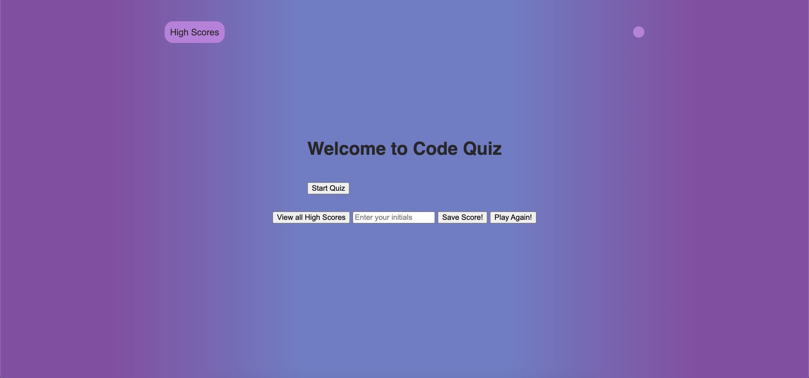

# web-api-quiz-project

This project was to build a online quiz with high scores, local storage and an adjusting timer.

It has been a challenge to get a few aspects of this application to work, namely the timer being adjusted by the question answers.

I did receive some help with this during tutor sessions.

This was useful learning about storing information locally, as well as having reactive elements on the site.

The deployed code is accessible here: https://github.com/dylanadams98/web-api-quiz-project

The deployed page is accessible here: https://dylanadams98.github.io/web-api-quiz-project

